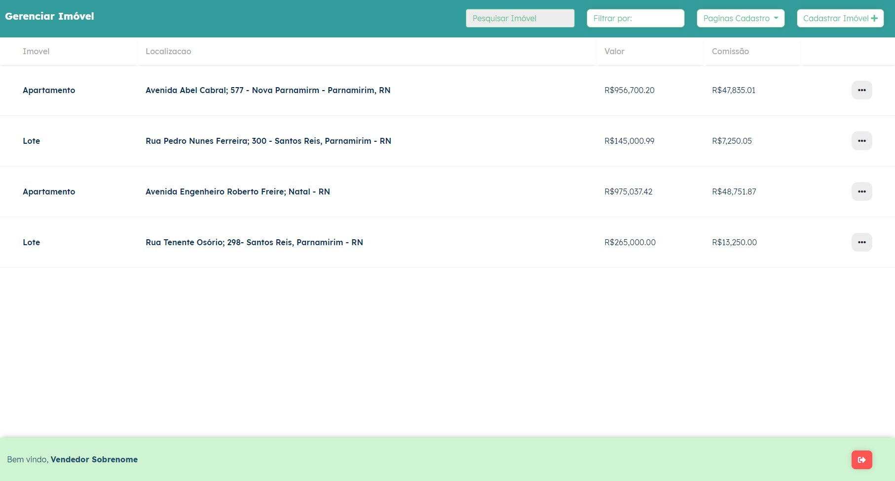
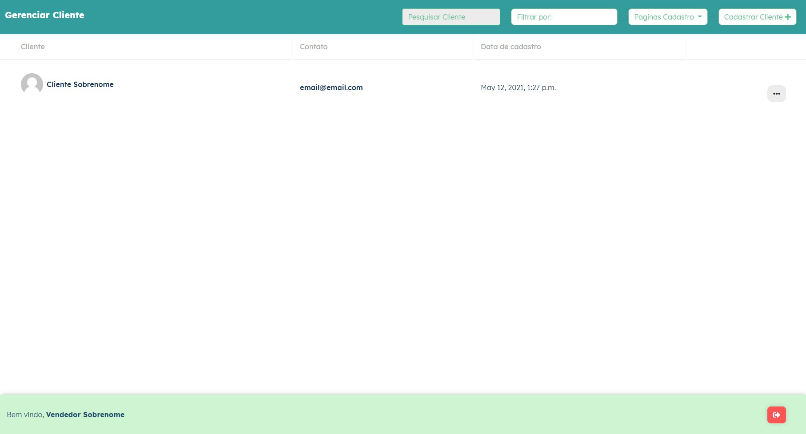
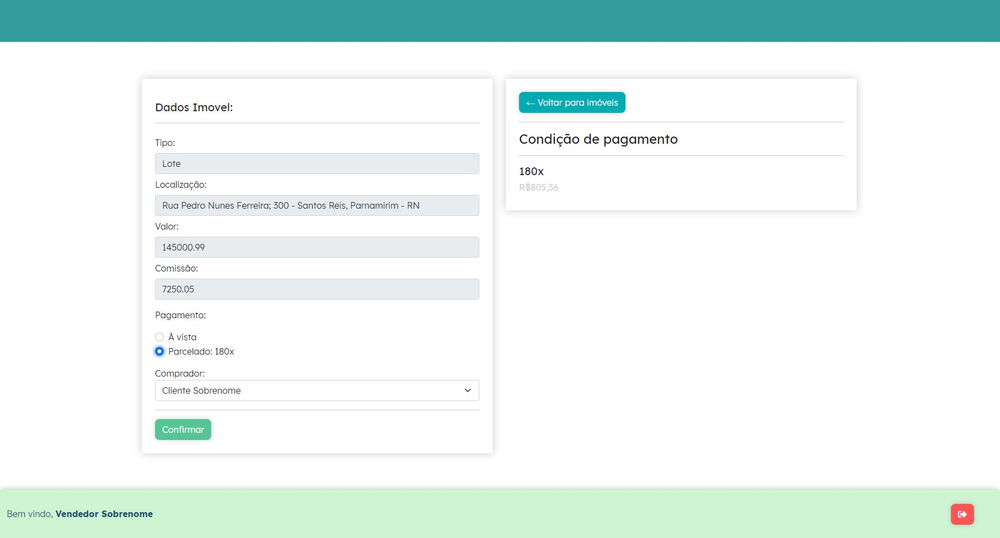
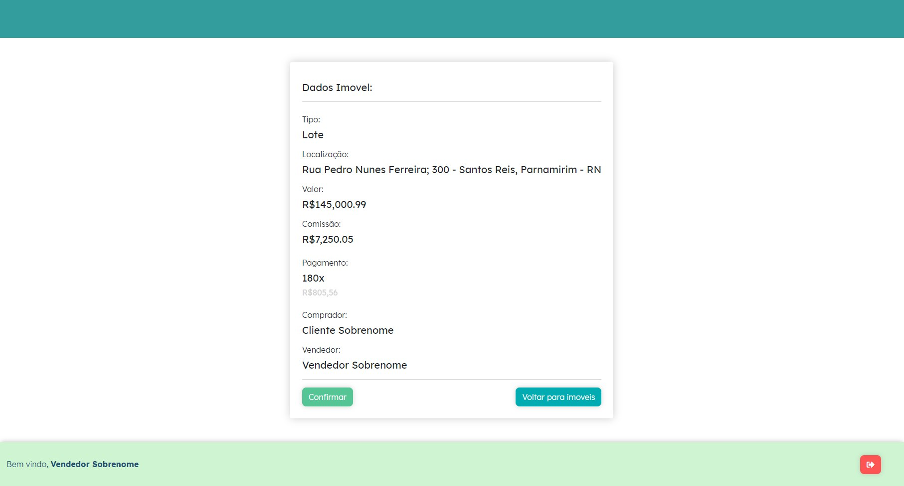

# venda-imoveis
### Projeto de criação de sistema para cadastro de imóveis, clientes e realização cadastro de venda de imóveis
<hr>

```bash
# Clone o repositório
$ git clone https://github.com/flpfrnc/venda-imoveis.git

# Instale o virtual environment
$ pip install virtualenv

# Acesse a pasta do projeto
$ cd venda-imoveis

# inicie o virtual environment
$ virtualenv env

# ative o virtual environment
$ . env/bin/activate

# instale as dependências
$ pip install -r requirements.txt

# inicie o servidor
$ python3 manage.py runserver
```

#### O projeto foi desenvolvido utilizando (Python3 + Django), JQuery, Sass ( utilizando uma dependência para que o Django reconheça os arquivos Sass como css )
#### Banco de dados utilizado: <i>Padrão do django: Sqlite3</i>

##### Vendedor já cadastrado no banco
##### Dados vendedor:
- login: <i>vendedor</i>
- senha: <i>imovel123</i>

##### Dados admin (Para login na página: <i>localhost:8000/admin</i> ):
- login: <i>admin</i>
- senha: <i>admin</i>


##### O projeto conta com:
- página que lista imóveis



- página que lista os clientes


  
- página de simulação de venda



- página de resumo de venda 


